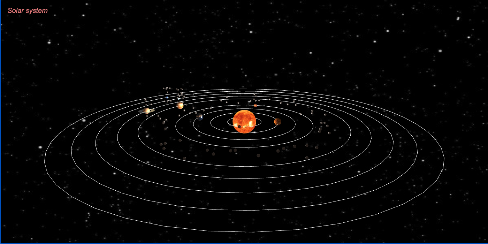

# Tarea 2 - Sistema Solar con [threejs](https://threejs.org/)
 Simulación de sistema solar generado con javascript y threejs

### Preview


### Live Server 🔧

Live Server es una herramienta de Visual Studio Code que permite vizualizar el proyecto en un servidor local

Se recomienda su uso para la ejecución de los archivos en el navegador


### Información de los planetas
Se consultaron diferentes fuentes de información para poder determinar la información necesaria de cada planeta

* [Rotation Speed](https://laughingsquid.com/rotation-speed-of-planets-in-solar-system/)
* [Orbit Speed](http://www.astronoo.com/en/articles/positions-of-the-planets.html)
* [Planet Radius](https://www.smartconversion.com/otherInfo/Equatorial_Radius_of_planets_and_the_sun.aspx#)
* [Planet Map and Bump](http://planetpixelemporium.com/)

JSON con los datos de cada planeta y el sol.
```
planets = [
    {
        name: 'Sun',
        radius: 2,
        mapTexture: '../images/sun_texture.jpg'
    },
    {
        name: 'Mercury',
        radius: 0.2439,
        rotationSpeed: 0.0030,
        orbitSpeed: 0.048,
        mapTexture: '../images/mercurymap.jpg',
        bumpTexture: '../images/mercurybump.jpg',
        bumpMapScale: 0.005,
        moons: 0
    },
    {
        name: 'Venus',
        radius: 0.6051,
        rotationSpeed: 0.0018,
        orbitSpeed: 0.03502,
        mapTexture: '../images/venusmap.jpg',
        bumpTexture: '../images/venusbump.jpg',
        bumpMapScale: 0.005,
        moons: 0
    },
    {
        name: 'Earth',
        radius: 0.6378,
        rotationSpeed: 0.2651,
        orbitSpeed: 0.02978,
        mapTexture: '../images/earth_atmos_2048.jpg',
        bumpTexture: '../images/earth_atmos_2048_bump.jpg',
        specularTexture:'../images/earth_specular_spec_1k.jpg',
        bumpMapScale: 0.005,
        moons: 1
    },
    {
        name: 'Mars',
        radius: 0.3396,
        rotationSpeed: 0.2408,
        orbitSpeed: 0.02407,
        mapTexture: '../images/marsmap1k.jpg',
        bumpTexture: '../images/marsbump1k.jpg',
        bumpMapScale: 0.005,
        moons: 4
    },
    {
        name: 'Jupiter',
        radius: 0.71492,
        rotationSpeed: 10.572,
        orbitSpeed: 0.013069,
        mapTexture: '../images/jupitermap.jpg',
        moons: 4
    },
    {
        name: 'Saturn',
        radius: 0.60268,
        rotationSpeed: 8.0179,
        orbitSpeed: 0.00964,
        mapTexture: '../images/saturnmap.jpg',
        ringTexture: '../images/saturnringcolor.jpg',
        bumpMapScale: 0.005,
        moons: 7
    },
    {
        name: 'Uranus',
        radius: 0.25559,
        rotationSpeed: 2.5875,
        orbitSpeed: 0.00681,
        mapTexture: '../images/uranusmap.jpg',
        moons: 27
    },
    {
        name: 'Neptune',
        radius: 0.2476,
        rotationSpeed: 0.0030,
        orbitSpeed: 0.00543,
        mapTexture: '../images/neptunemap.jpg',
        moons: 14
    },
    {
        name: 'Pluto',
        radius: 0.01195,
        rotationSpeed: 0.00035,
        orbitSpeed: 0.0472,
        mapTexture: '../images/plutomap1k.jpg',
        moons: 0
    },

]
```
### Generalidades
Para la creacion de la mayoria de los objetos se necesitan cuatro variables, una que sera el grupo del objeto y su planeta, otra para el grupo de la simulacion de su orbita, otra que sera el pivote del objeto y finalmente otro pivote que simulara la orbita alrededor del Sol.

### Creacion de planetas

Para la creación de planetas se realizaron dos funciones, una que se usara cuando el planeta tenga bumpTexture y otra cuando no la tenga.

Primero definimos la geometria de manera global antes de crear el planeta
```
geometry = new THREE.SphereGeometry(planet.radius/10,32,32);
```
Posteriormente se llama la funcion para crear el planeta, esta función recibe como parametro el numero de lunas y la textura
### createPlanet(moons: number, mapTexture: string)
```
function createPlanet(moons, mapTexture){
    //Grupo para planeta y su pivote
    planetGroup = new THREE.Object3D;
    //Grupo para simulacion de orbita
    planetGroupOrbit = new THREE.Object3D;
    //pivote del planeta
    pivot = new THREE.Object3D;
    //pivote para simular orbita alrededor del sol
    pivotForOrbit = new THREE.Object3D;
    //creacion de planeta
    let texture = new THREE.TextureLoader().load(mapTexture);
    //Parte es opcional, solo si se cuenta con el bumpmap del planeta
    let bumpMap = new THREE.TextureLoader().load(bumpTexture);
    let material = new THREE.MeshPhongMaterial({
        map: texture,
        bumpMap: bumpMap,
        bumpScale: bumpMapScale
    });
    //Parte es opcional, solo si se cuenta con el specularTexture del planeta
    if(specularTexture){
        material.specularMap = new THREE.TextureLoader().load(specularTexture);
        material.specular = new THREE.Color(0x808080);
        material.shininess = 50.0;
    }
    else{
        material.shininess = 1.0;
    }
    astro = new THREE.Mesh(geometry, material);
    astro.receiveShadow = true;
    //console.log(astro);
    planetGroup.add( astro );
    planetGroup.add( pivot );

    //La posision depende de cuantos objetos hemos agregadp
    planetGroup.position.set((0.2 * (objects.length + 1 )),0,(0.2 * (objects.length + 1)));
    //Existe otra funcion que se llama despues de que se crea Marte y la posicion cambia por la 
    //adicion de asteroides, la posicion quedaria como:
    // planetGroup.position.set((0.2 * (objects.length + 3 )),0,(0.2 * (objects.length + 1)));

    if(moons>0){
        for(let i = 0; i < moons; i++){
            addMoon(pivot);
        }
    }

    pivotG.push(pivot);
    objects.push(planetGroup);

    //console.log(planetGroup);
    //Agregamos el planeta al grupo que simulara su orbita
    planetGroupOrbit.add(planetGroup);
    planetGroupOrbit.add(pivotForOrbit);
    //La posicion tiene que estar en el origen ya que queremos que giren alrededor del Sol
    planetGroupOrbit.position.set(0,0,0);
    pivotOrbit.push(planetGroupOrbit);
    scene.add(planetGroupOrbit);
}
```

### Creación de lunas

Se manda a llamar una funcion para agregar lunas a cada planeta (en caso de que existan), recibe como parametro el pivote del planeta al cual le vamos a agregar una nueva luna y la posicion se calcula de manera random.

### addMoon(pivot: THREE.Object3D)
````
function addMoon(pivot){
    let texture = new THREE.TextureLoader().load('../images/moon_1024.jpg');
    let bumpMap = new THREE.TextureLoader().load('../images/moon_bump.jpg');
    let material = new THREE.MeshPhongMaterial({
        map: texture,
        bumpMap: bumpMap,
        bumpScale: 0.5,
    });
    //Grupo de luna
    moonGroup = new THREE.Object3D;
    pivot.add(moonGroup);
    geometry = new THREE.SphereGeometry(0.01738, 32, 32);
    luna = new THREE.Mesh(geometry, material);
    luna.receiveShadow = true;
    moonGroup.add( luna );
    pivotMoons.push( luna );
    moonGroup.position.set((Math.floor(Math.random() * 2)- 1)/ 10,(Math.floor(Math.random() * 4)- 1)/10,(Math.floor(Math.random() * 2)- 1)/10);

}
`````

### Creación de asteroides

Se llama a una funcion que recibe como parametro el numero de asteroides para ser creados. Su posicion se calcula con cos() en x y sin() en z de manera aleatoria.

### asteroidBelt(num: number)


```
function asteroidBelt(num){
    let asteroidGroup;
    for(i=0; i< num; i++){
        asteroidGroup = new THREE.Object3D;
        asteroidOrbit = new THREE.Object3D;
        pivot = new THREE.Object3D;
        pivotForAOrbit = new THREE.Object3D;

        let texture = new THREE.TextureLoader().load('../images/asteroidmap.jpg');
        let material = new THREE.MeshPhongMaterial({map: texture});

        geometry = new THREE.SphereGeometry(0.02, 32, 32);

        asteroid = new THREE.Mesh(geometry, material);
        asteroid.receiveShadow = true;
        asteroid.castShadow = true;

        asteroidGroup.add(asteroid);
        asteroidGroup.add( pivot );

        let x = (0.28 * (objects.length + 1)) * (Math.cos(i) + ((Math.random() * 0.2) - 0.1));
        let y = (Math.random()*0.2)-0.1;
        let z = (0.28 * (objects.length +1)) * (Math.sin(i)+ ((Math.random() * 0.2)-0.1));
        asteroidGroup.position.set(x,y,z);
        pivotAsteroids.push(asteroidGroup);

        asteroidOrbit.add(asteroidGroup);
        asteroidOrbit.add(pivotForAOrbit);
        //pivote para girar alrededor del sol
        asteroidOrbit.position.set(0,0,0);
        pivotAsteroidOrbit.push(asteroidOrbit);
        scene.add(asteroidOrbit);
    }
}

```
### Creacion del Sol
Para crear el Sol se uso un material MeshBasicMaterial para poder hacer uso de una PointLight y simular el brillo proveniente del Sol. La función recibe como parametro la textura del Sol.
### Sun(suntexture: string)
`````
function Sun(suntexture){
     
    planetGroup = new THREE.Object3D;
    
    pivot = new THREE.Object3D;
    //Creacion del Sol
    let texture = new THREE.TextureLoader().load(suntexture);
    let material = new THREE.MeshBasicMaterial({map: texture});
    let sun = new THREE.Mesh(geometry, material);
    sun.receiveShadow = false;
    sun.castShadow = false;

    planetGroup.add( sun );
    planetGroup.add( pivot );

   planetGroup.position.set(0,0,0);
 
   scene.add( planetGroup );

   let light = new THREE.PointLight(0xffffff);
   light.position.set(0,0,0);
   light.intensity = 1.3;

   sun.add(light);

}
``````

### Creación del Sistema Solar

Dependiendo de cada astro se manda a llamar su funcion correspondiente (astro con bumpmap o sin bummap) y se agrega el cinturon de asteroides 

### createSolarSystem()
````
function createSolarSystem(){
    let ring = 70;
    let innerRadius, outerRadius;
    planets.forEach((planet, i) => {
        console.log(i);
        geometry = new THREE.SphereGeometry(planet.radius/10,32,32);

        if(planet.name == 'Sun'){
            Sun(planet.mapTexture);
        } else if(planet.name == 'Jupiter' || planet.name == 'Uranus' || planet.name == 'Neptune' || planet.name == 'Pluto'){
            //console.log(planet);
            createPlanet(planet.moons,planet.mapTexture);
        } else if(planet.name == 'Mercury' || planet.name == 'Venus' || planet.name == 'Mars'){
            planetWithBump(planet.moons, planet.bumpMapScale, planet.mapTexture, planet.bumpTexture);
        } else if(planet.name =='Saturn'){
            createPlanet(planet.moons,planet.mapTexture);
            innerRadius = (planet.radius * 0.15)/planet.radius;
            outerRadius =(planet.radius * 0.08)/planet.radius;
            saturnRing(innerRadius,outerRadius,ring,planet.ringTexture);
        } else if(planet.name = 'Earth'){
            planetWithBump(planet.moons, planet.bumpMapScale, planet.mapTexture, planet.bumpTexture, planet.specularTexture);
        }
        if(i == 4){
            console.log("Se crearan los asteroides")
            asteroidBelt(50);
        }
    })
}
````
### Animación
Para la animacion iteramos sobre todos los arreglos que hemos creado para que cada objeto pueda rotar alrededor de su eje y alrededor de su pivote (Sol o planeta).

### animate() 
````
function animate() 
{
    let now = Date.now();
    let deltat = now - currentTime;
    currentTime = now;
    let fract = deltat / duration;
    let angle = Math.PI * 2 * fract;

    //Rotacion de las lunas sobre cada planeta
    pivotG.forEach(moon => {
        moon.rotation.y += (Math.random() * (0.03) + 0.02) + angle;
    })
    //Rotacion de las lunas sobre su propio eje
    pivotMoons.forEach(moon => {
        moon.rotation.y += (Math.random() * (0.05) + 0.05) + angle;
    })
    //Rotacion de los asteroides sobre su propio eje
    pivotAsteroids.forEach(asteroid => {
        asteroid.rotation.y += (Math.random() * (0.05) + 0.05) + angle;
    })
    //Rotacion de los asteroides alrededor del Sol
    pivotAsteroidOrbit.forEach(asteroid => {
        asteroid.rotation.y += (Math.random() * (0.0000001) + 0.00000001) + angle;
    })
    //Movimiento de cada planeta con su velocidad orbital correspondiente
    pivotOrbit.forEach((planet, index) => {
        //console.log(planets[index+1].orbitSpeed);
        //console.log(pivotOrbit.length);
        planet.rotation.y += planets[index+1].orbitSpeed;
    })
    //Rotacion de cada planeta alrededor de su propio eje con su velocidad correspondiente
    objects.forEach((planet, index) => {
        planet.children[0].rotation.y += planets[index+1].rotationSpeed; 
    })

    orbitc.update();

}
````


### Escena

Para la creacion de la escena usamos la PerspectiveCamera de threejs para ver la escena y un OrbitControls para poder controlar la camara. La funcion recibe como parametro el canvas

### createScene(canvas)

````
function createScene(canvas)
{    
    // Create the Three.js renderer and attach it to our canvas
    renderer = new THREE.WebGLRenderer( { canvas: canvas, antialias: true } );

    // Set the viewport size
    renderer.setSize(canvas.width, canvas.height);
    
    // Create a new Three.js scene
    scene = new THREE.Scene();

    // Set the background image
    scene.background = new THREE.TextureLoader().load('../images/space.jpg');
    // scene.background = new THREE.Color( "rgb(100, 100, 100)" );

    // Add  a camera so we can view the scene
    camera = new THREE.PerspectiveCamera( 45, canvas.width / canvas.height, 1, 4000 );
    camera.position.x = 5;
    camera.position.y = 2;
    camera.position.z = -1.3;
    scene.add(camera);

    // This light globally illuminates all objects in the scene equally.
    // Cannot cast shadows
    let ambientLight = new THREE.AmbientLight(0xffccaa, 0.4);
    scene.add(ambientLight);
    //Orbit controls allow the camera to orbit around a target.
    orbitc = new THREE.OrbitControls(camera, renderer.domElement);
    createSolarSystem();
    console.log(objects);
    Orbits(objects.length);
}
`````


---