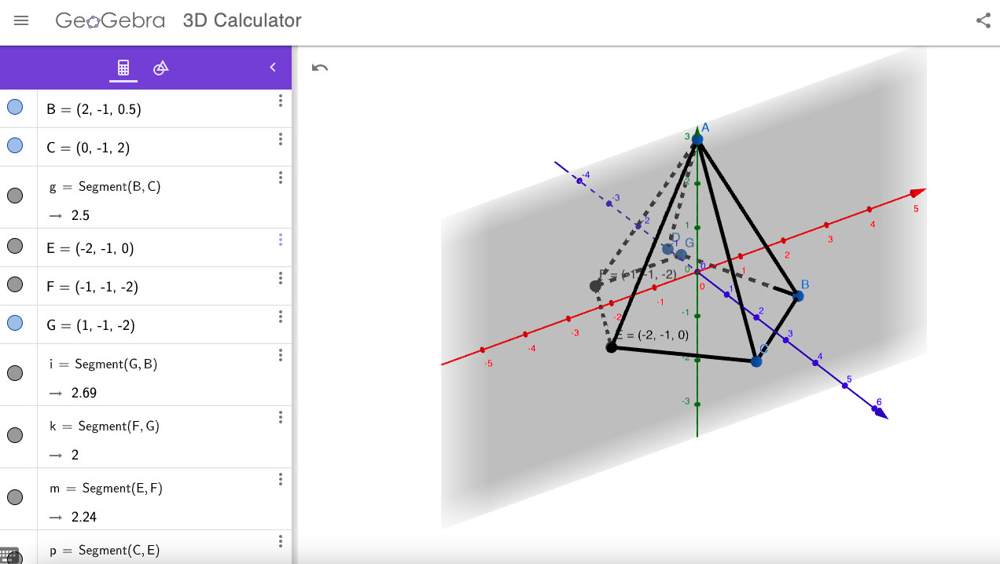
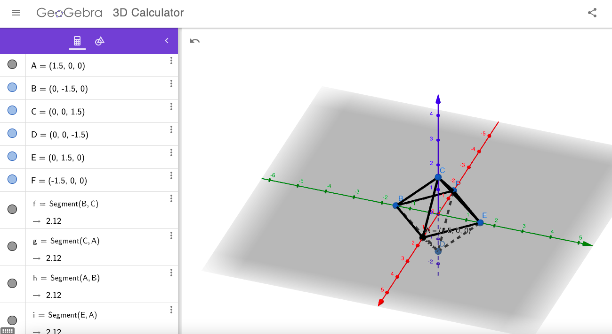

# Tarea 1 - Figuras con WebGL
_Utilizando WebGL dibujamos diferentes figuras tales como una pirámide pentagonal, un dodecaedro y un octaedro_

### Pre-requisitos 📋

_Es necesario contar con un navegador que soporte WebGL_

_Es necesario contar con las librerias:_
* [gl-matrix](https://github.com/toji/gl-matrix)
* [jquery](https://github.com/jquery/jquery)

### Live Server 🔧

_Live Server es una herramienta de Visual Studio Code que permite vizualizar el proyecto en un servidor local_

_Una vez instalada esta extensión, dar click en 'Go Live' en la parte inferior derecha de la pantalla para mostrar el proyecto en el navegador predeterminado_


### Puntos importantes

_Lo que cambia de cada figura son:_

* _El orden y numero de vertices para dibujar correctamente las caras de cada figura_
* _La funcion que hace push del color en cada vertice ya que cada figura es diferente y tienen diferentes numeros de vertices_
* _El orden y número de indices (punto importante para el dibujo de la figura)_

### Piramide  Pentagonal

_Para construir esta pirámide se hizo uso de GeoGebra 3D para calcular los puntos que después serían usados en las matrices de vertices_



### Dodecaedro

_Para esta figura se uso un modelo ya creado en GeoGebra para obtener los puntos de una manera más sencilla_

[Dodecaedro](https://www.geogebra.org/m/wMCYtgcY)

_Las caras siguen el siguiente orden de puntos_

* _Cara 1: A->M->B->S->Q_
* _Cara 2: C->Q->S->D->O_
* _Cara 3: A->Q->C->L->T_
* _Cara 4: A->I->E->N->M_
* _Cara 5: M->N->F->J->B_
* _Cara 6: B->J->K->D->S_
* _Cara 7: D->O->P->H->K_
* _Cara 8: C->L->G->P->O_
* _Cara 9: I->E->R->G->L_
* _Cara 10: N->F->T->R->E_
* _Cara 11: J->K->H->T->F_
* _Cara 13: G->R->T->H->P_

## Octaedro

_Para construir esta figura se hizo uso de GeoGebra 3D para obtener los puntos_


_También se modifico la función update para que la figura pudiera tener movimiento agregando el siguiente pedazo de codigo:_
```
if(bottom==true){
    mat4.translate(this.modelViewMatrix, this.modelViewMatrix, [0, 0.025, 0]);
    if(this.modelViewMatrix[13] > 1.25){ //checking current position to change behavior
        bottom=false;
        top=true;
    }
}
if(top==true){
    mat4.translate(this.modelViewMatrix, this.modelViewMatrix, [0, -0.025, 0]);
    if(this.modelViewMatrix[13] < -1.25){ //checking current position to change behavior
        bottom=true;
        top=false;
    }
}
```


---